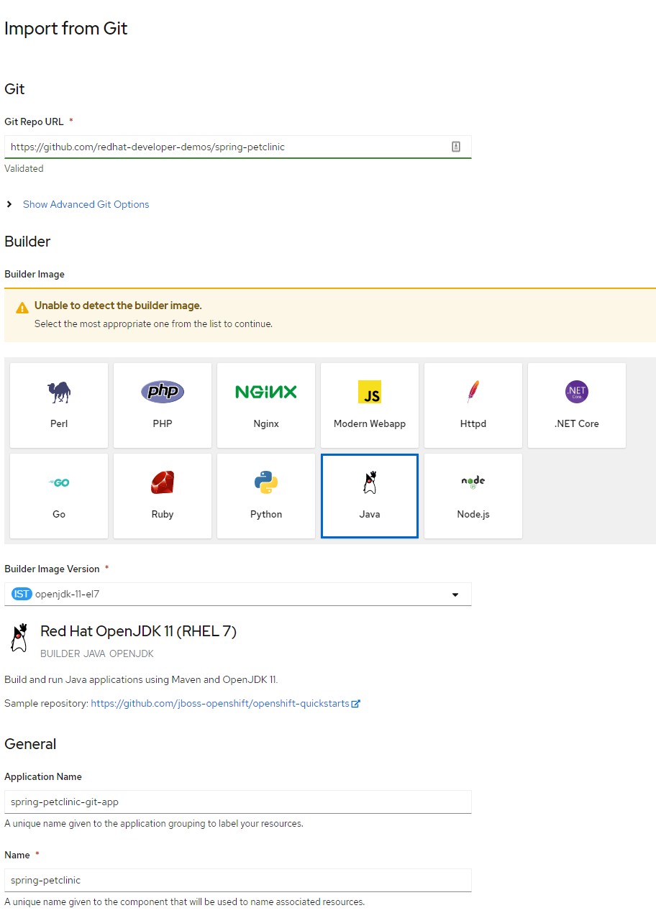

# Spring Pet Clinic and the Developer Sandbox for Red Hat OpenShift

This repo contains a container-ready implementation of the iconic Spring Petclinic application. Specifically, this code is useful with the OpenShift Source-to-Image (s2i) technology and is part of the introductory material for [Developer Sandbox for Red Hat OpenShift](https://developers.redhat.com/developer-sandbox).

## OpenShift Implementation
Get your *free*  OpenShift cluster to run this demo. You can get free access to Developer Sandbox for Red Hat OpenShift at: https://developers.redhat.com/developer-sandbox


### Dev Console

Make sure you are in the Developer perspective:


And create a new MySQL instance by clicking the `+Add` button and choosing the `Database` option:


Choose MySQL Ephemeral:


and Click `Instantiate Template`.

Then fill the wizard with the following parameters:


Click the `Create` button. 

We are using the **Ephemeral** implementation because this a short-lived demo and we do not need to retain the data.  

In a production system, you will most likely be using a permanent MySQL instance. This stores the data in a Persistent Volume (basically a virtual hard drive), meaning the MySQL pod can be destroyed and replaced with the data remaining intact.

### Deploy Pet Clinic App


Click the `+Add` button and choose `From Git` type:

Fill the git repo with the following value `https://github.com/redhat-developer-demos/spring-petclinic` and select the project as Java project:



Click the `Build Configuration` link:


Add the following environment variables:

```
SPRING_PROFILES_ACTIVE=mysql
MYSQL_URL=jdbc:mysql://mysql:3306/petclinic
```


Finally click the `Create` button and wait until the Build is done and the Pod is up and running (dark blue around the deployment bubble). In testing this using the Developer Sandbox for Red Hat OpenShift, this step took approximately six minutes. Please note: You *may* see error messages in the Sandbox. They are temporary while the application builds.  

Then push the Open URL button to view the Pet Clinic app:


And if you visit the MySQL deployment's Terminal then you connect to the database to see the schema and data


```
mysql -u root -h mysql -p

petclinic

use petclinic;
show tables;
```


```
select * from owners;
```


`### End ###`
