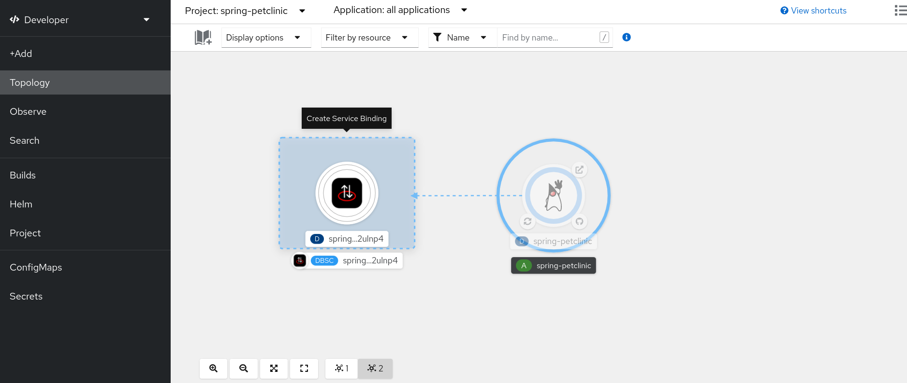

# Spring Pet Clinic integration with Red Hat OpenShift Database Access (RHODA)

This repo contains a container-ready implementation of the iconic Spring Petclinic application. Specifically, Crunchy Bridge is set up via RHODA for the persistent database configuration of the application.

### Crunchy Bridge

Follow the [instructions](https://docs.crunchybridge.com/quickstart/provision/) to create an account.


Then [create an API key](https://docs.crunchybridge.com/api-concepts/getting-started/#authentication), which generates an application ID and application secret for your use.


### Administrator Console

Make sure you are in the Administrator perspective:


Create a project with name `spring-petclinic`.


In the OperatorHub, install the OpenShift Database Access operator.


Then create an RHODA tenant from the CustomResourceDefinitions for the `spring-petclinic` project.

```
apiVersion: dbaas.redhat.com/v1alpha1
kind: DBaaSTenant
metadata:
  name: spring-petclinic-tenant
spec:
  authz:
    groups:
      - 'system:authenticated'
  connectionNamespaces:
    - '*'
  inventoryNamespace: spring-petclinic
```


In the RHODA operator, create a Provider Account, select Crunchy Bridge as the provider, and enter the Crunchy Bridge API key as Account Credentials.


### Dev Console

Make sure you are in the Developer perspective:


Connect to a database by selecting Crunchy Bridge and Connect.


Create a database instance with name `spring-petclinic-instance`.


Then select the instance just created.


Scroll to the bottom of the instance list and Connect.


In the Topology view, a connection to the database instance is created.


### Deploy Pet Clinic App

Click the `+Add` button and choose `From Git` type:

Fill the git repo with the following value `https://github.com/xieshenzh/spring-petclinic.git`, enter `rhoda` as Git reference and build the project as Java project:


Select the `Deployment Configuration` and add the following environment variables:

```
SPRING.PROFILES.ACTIVE=postgres 
ORG.SPRINGFRAMEWORK.CLOUD.BINDINGS.BOOT.ENABLE=true
```


Then click the `Create` button. 

In the Topology view, drag an arrow from the application to the database connection, which creates a Service Binding.



Wait for the application build and deployment to finish, which takes around 5 minutes. Then click Open URL from the application to launch the application UI.


If you visit the application deployment's Terminal, you can get the database connection information.


Then you can connect to the database with the connection information by using the `psql` command line interface.

```shell
psql -U postgres -p 5432 -h <host> postgres
```

```
select * from vets;
```


